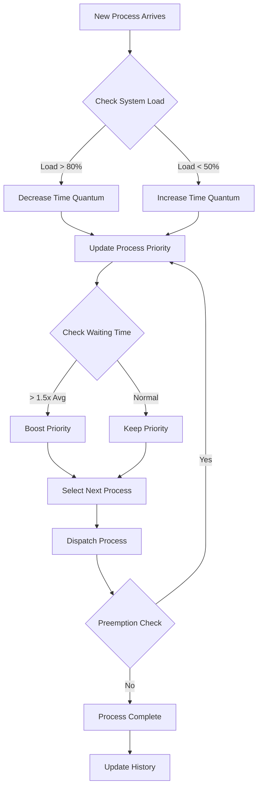

# Adaptive CPU Scheduling Simulator Design Document

## 1. Introduction to Adaptive CPU Scheduling

Adaptive CPU scheduling is a dynamic approach to process scheduling that adjusts its parameters and policies based on real-time system conditions. Unlike traditional scheduling algorithms that use fixed parameters:

- **FCFS (First Come First Serve)**: Simple queue-based execution
- **SJF (Shortest Job First)**: Static burst time based decisions
- **Priority Scheduling**: Fixed priority assignments
- **Round Robin**: Fixed time quantum
- **Multilevel Feedback Queue**: Predefined number of queues and fixed promotion/demotion rules

Adaptive scheduling continuously monitors system metrics and adjusts its behavior to optimize performance.

## 2. Adaptive Strategies

### 2.1 Dynamic Time Quantum Adjustment
- Monitors CPU utilization and queue length
- Decreases time quantum when system load > 80% to improve responsiveness
- Increases time quantum when load < 50% to reduce context switches
- Formula: new_quantum = base_quantum * (1 ± load_factor)

### 2.2 Priority Aging with Waiting Time
- Tracks waiting time for each process
- Boosts priority if waiting_time > 1.5 * avg_waiting_time
- Prevents starvation while maintaining fairness
- Formula: dynamic_priority = base_priority + (waiting_time / avg_waiting_time)

### 2.3 Predictive Burst Time Learning
- Records actual burst times of completed processes
- Groups similar processes based on characteristics
- Adjusts initial burst time estimates for new processes
- Uses moving average of similar process histories

## 3. Key Metrics

1. **Turnaround Time**
   - Definition: Time from process arrival to completion
   - Formula: completion_time - arrival_time

2. **Waiting Time**
   - Definition: Time spent in ready queue
   - Formula: turnaround_time - burst_time

3. **Response Time**
   - Definition: Time from arrival to first CPU burst
   - Formula: first_run_time - arrival_time

4. **CPU Utilization**
   - Definition: Percentage of time CPU is busy
   - Formula: (total_burst_time / total_time) * 100

5. **Throughput**
   - Definition: Number of processes completed per unit time
   - Formula: completed_processes / total_time

6. **Fairness Index**
   - Definition: Variance in waiting times across processes
   - Formula: 1 - (std_dev(waiting_times) / mean(waiting_times))

## 4. System Architecture

### 4.1 Core Components

```
                    ┌─────────────────┐
                    │  Process Table  │
                    └────────┬────────┘
                             │
┌────────────┐    ┌─────────▼────────┐    ┌──────────────┐
│   Ready    │◄──►│    Scheduler     │◄──►│  Dispatcher   │
│   Queue    │    │    (Adaptive)    │    │              │
└────────────┘    └─────────┬────────┘    └──────────────┘
                             │
                    ┌────────▼────────┐
                    │ Metrics Logger  │
                    └─────────────────┘
```

### 4.2 Component Details

1. **Process Control Block (PCB)**
```python
class PCB:
    pid: int
    arrival_time: float
    burst_time: float
    priority: int
    remaining_time: float
    waiting_time: float
    turnaround_time: float
    last_run_time: float
    state: ProcessState
```

2. **Ready Queue**
- Priority heap implementation
- Dynamic reordering based on adaptive metrics
- Multiple queues for different priority levels

3. **Scheduler**
- Policy selection and enforcement
- Dynamic parameter adjustment
- Process state transitions

4. **Dispatcher**
- Context switching simulation
- CPU burst execution
- Preemption handling

5. **Metrics Collector**
- Real-time statistics gathering
- Performance metric calculation
- History tracking for prediction

## 5. Scheduling Decision Flow



## 6. Implementation Plan

1. Core Data Structures (`core.py`)
   - Process and PCB classes
   - Ready Queue implementation
   - System state management

2. Base Schedulers (`schedulers.py`)
   - FCFS implementation
   - SJF implementation
   - Round Robin implementation

3. Adaptive Scheduler (`adaptive_scheduler.py`)
   - Dynamic quantum adjustment
   - Priority aging system
   - Predictive components

4. Metrics & Analysis (`metrics.py`)
   - Statistics collection
   - Performance calculations
   - History tracking

5. Visualization (`visualizer.py`)
   - Gantt chart generation
   - Metric plotting
   - Real-time updates

## 7. Testing Strategy

1. Unit Tests
   - Individual component testing
   - Algorithm correctness
   - Edge case handling

2. Integration Tests
   - Full system workflows
   - Multi-process scenarios
   - Performance benchmarks

3. Comparison Tests
   - Adaptive vs traditional algorithms
   - Different load scenarios
   - Stress testing